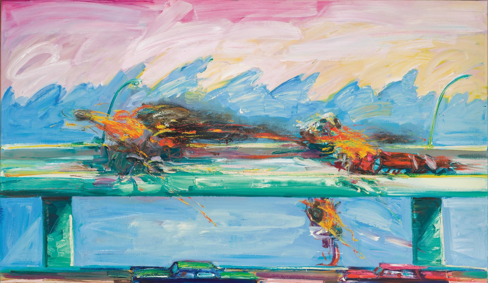

% THE SUBURBAN CONQUEST OF CALIFORNIA
% Hayden J. Rinn
% 2022-03-17

*NOTE: This essay is not a standard historical essay. It is a project proposal for a public memory project, as determined by the final assignment of my History of California class. However, it still contains a good deal of interesting historical context and analysis.*

## PROJECT SUMMARY
In 1950, the California Highways and Public Works department published the centennial edition of its official journal. On this 100th anniversary of the state’s admission to the union, the CHPW intended to celebrate the great progress achieved through the construction of highways, and to frame this progress as a historical trend that had been long in the making --- well before the era of automobiles. The purpose of this journal is best summarized by its foreword, a short note located adjacent to a portrait of Junipero Serra, as well as pictures of nine of the senior directors of the California Highway Commission: 

> In the chapters written by Alice Fisher Simpson and Stewart Mitchell is unfolded the story of California’s first famous Emigrant Trails and the people who blazed them: The trails of the early explorers in the service of His Majesty, the King of Spain; the immortal Padres intent on planting the cross of Christendom among the heathen children of the wilderness; the fur traders and the mountain men, restless and adventurous; the white-covered wagons of the emigrant trains, answering the call of “Gold!” It is the colorful epic of stagecoach days, when the sturdy Concords, rocking and swaying, rumbled over the narrow, twisted roads of the ‘60’s and ’70’s; the mule-teams and the cumbersome freighters—whose glory was dimmed by the coming of the “Iron Horse.”
>
> Today, many of these famous old trails have become important U.S. and state highways, over which the motorist may travel with ease and comfort—basking in the romance of yesterday, and reliving the dynamic events of California’s glorious past.[^1] 

Clearly, the historical perspective presented by this document is antiquated. Today, many members of the public are conscious of the devastating effects that the mission system, the gold rush, and American emigration had on the indigenous people of California. It is common to view people like Serra as nuanced and controversial historical figures, who should not necessarily be glorified. In this context, it may seem shortsighted for California’s Highway Commission to have equated themselves with some of the most problematic and destructive trends in California’s history. However, I argue that this is an apt comparison. California’s highways, and suburban development more broadly, subjugated lower-class workers and people of color. The state actively opposed existing, more equitable systems in order to pursue decentralized development. Thus, I propose the creation of a foil report --- a counter to the perspective presented by CHPW’s centennial edition publication. This report would highlight the devastating effects of suburban and car dependent development, situate this trend as another destructive force in California’s history of conquest and colonization, and pinpoint California as the origin of this national pattern of development.

## PUBLIC LEARNING OBJECTIVES
The objective of this project is to address a disconnect in public historical thinking—namely, a tendency to hold a critical perspective on much of California’s history, but to blindly accept suburban development as progress, or even serve to reinforce it. This tendency is due to a lack of awareness of the negative effects of suburban development. This project seeks to help the public understand how suburban development in Los Angeles and California led to the suppression of the labor movement, uneven development between white and non-white communities, and the intentional destruction of ethnically diverse neighborhoods through the construction of highways. This development was not inevitable, rather, it was intentionally pursued at the expense of a different path: healthier, diverse, and more equitable cities supported by accessible public transit. Through an understanding of this history, members of the public will build a critical perspective on suburban development and, if the project is successful, decide to actively oppose the system’s continuation.

## AUDIENCE IDENTIFICATION
The tendency to ignore and reinforce the negative aspects of suburban development is noticeable and most hypocritical among a particular demographic: liberal Californians. This can be seen in the statewide battle over zoning laws. Single-family residential zoning laws were essential to the creation of the suburbs and currently serve to maintain them. Single-family zoning mandates that only detached houses occupied by one family can be constructed—the lowest density and least affordable residential zoning. The Los Angeles City Planning Commission created the first modern zoning system in the 1910’s, which included the first single-family zoning law. Residential, commercial, and industrial zoning ensured “segregation of use”. Single-family zoning ensured “segregation of population.”[^2] The minority groups of Los Angeles, poorer than much of the white population, would not be able to afford a detached home in these newly zoned neighborhoods. The commission created this law to reinforce the existing racial divisions of Los Angeles.

Today, the situation has not improved much. Seventy-eight percent of residential land in greater Los Angeles is still single-family zoned.[^3] In a strongly liberal city, especially one with a housing crisis, this makes no sense, as single-family zoning is a direct obstacle to the construction of affordable housing. This problem still exists because, time and time again, Californians have fought attempts to rezone their neighborhoods. In 2013, the residents of Palo Alto voted to overturn a resolution that rezoned a small lot to allow for the construction of 60 affordable housing units intended for low-income senior citizens. The primary complaint of the Palo Alto residents was that the development would be “out of scale” with the surrounding neighborhood.[^4] The residents of a city who voted 66% Democrat in the 2012 and 2016 presidential elections,[^5] rallied to reject an affordable housing initiative to preserve the aesthetic of their low-density neighborhood. Many liberal Californians have a fundamental disconnect between belief and action when it comes to affordable housing. They support initiatives at the ballot box, but they refuse to make real changes to their suburban communities. Therefore, they are a suitable target audience for this project. Californians who are politically invested enough to organize against rezoning initiatives are more likely to be receptive to a long form, written report related to the issue. Through understanding why the neighborhoods they live in were constructed, and how this development came at the expense of many other Californians of lesser means, the liberal occupants of suburbia would be encouraged to critically analyze their own surroundings.

## RESOURCE PLANNING
To mirror the length of the CHPW’s journal, the counter report would require historical research beyond the scope of this proposal. The arguments of this proposal, which are explored briefly below, contain historical analysis through the lens of class and race, and are supported by historiography. But this basis is nowhere near enough to rival the original 172-page journal.  Additionally, the original journal contains art and photography related to its contents. The proposed journal would contain the artwork of Californians who have resisted suburban and highway development, as explored by the scholar Eric Avila.[^6] This includes the work of Carlos Almaraz, a notable artist in the Chicano Movement. Many of his works are focused on highways, which also dominate the neighborhood where he grew up—East L.A.

{width=100%}

In “Crash in Phthalo Green,” Almaraz depicts the violence that highways bring to the communities they pass through, namely horrific car crashes. This painting also emphasizes how ingrained highways are in communities like East L.A. They are a permanent part of the landscape—-in this piece the highway nearly blends in with the sky. Another artist whose work depicts the consequences of highway development is Judith Baca. Her half mile long mural entitled “The Great Wall of Los Angeles,” is painted on a concrete wall of the Los Angeles river. The mural depicts a chronological history of Los Angeles from the perspective of oppressed peoples.

{width=100%}

In this section of the mural, Baca shows how suburban development has invaded the communities of East L.A. A writhing tentacle of highway has crashed through homes and pulled a family apart. Dodger Stadium looms on right side of the mural, like an alien spaceship. Many of the residents of the Chavez Ravine neighborhood were uprooted to build the stadium. The imagery of this section depicts suburban development as an invading alien force, removing the people who many Americans call aliens. Works such as these would enhance the proposal, and funding would be required to license existing art or commission new work. Finally, to distribute many copies of this report, large scale printing would be required.

## CONTRIBUTIONS TO PUBLIC DISCOURSE
This project contributes research and historical analysis to the nuanced issue of suburban development, in order to bring this conversation into the domain of public memory. Suburbanization weakened the labor movement, trapped non-white Californians in poverty, and destroyed existing diverse neighborhoods. Through an awareness of these harmful historical effects, the target audience will hopefully reconsider their position on the issue.

Decentralized industrialization in Los Angeles separated workers from the labor movement. As industry poured into L.A. in the 1920s, large factory-cities were established in the periphery. The Chamber of Commerce encouraged this pattern of development, as it led to “contented” workers living in individual houses around the factories.[^7] Conveniently, these workers were kept away from the labor movement that was concentrated among traditional industry downtown, and as a result, were significantly less likely to unionize. 

White flight, motivated by fomented racist attitudes, caused the uneven development of suburban, white communities at the expense of inner-city, non-white communities. Although white flight began after WWII, the effort to associate minorities with urban areas began earlier. In 1926, during a fight against a referendum to approve public transit running on elevated tracks, the L.A. Times contended that elevated trains would bring filth, gloom, and darkness.[^8] Beyond referencing the direct obfuscation of light by the raised tracks, ‘darkening’ the city had racial undertones, which the L.A. times played upon to successfully rally white residents against the referendum. By the time white flight began in full, there was a direct association between inner-cities and Black people. Racism motivated white flight, but it was encouraged by federal policy meant to incentivize suburban construction, specifically by the Homeowners Loan Corporation, the Federal Housing Administration, and the Veterans Administration.[^9] The resulting racial segregation, where whites acquired homes in the suburbs and non-whites remained in declining cities, was the most significant force for uneven development in modern America.[^10] 

Los Angeles’ city planners wielded development to destroy ethnically diverse neighborhoods. Boyle Heights is an L.A. neighborhood that was previously one of the most diverse in the city. As a result of redlining, it became one of the city’s most notable and concentrated Latino communities. In a 1939 city survey, an official for L.A.’s Homeowner’s Loan Corporation noted that Boyle Heights, “seems ripe for some type of slum clearance project.”[^11] Today, the 6.5 square mile neighborhood is host to four major freeways. 

This path of suburbanization was a pivot from the way Los Angeles was heading, which was centralization, robust public transportation, and decreasing racial tensions. The city’s planners chose decentralization. Their motives for this were plain—they believed centralized cities brought crime, poverty, and racial mixing.[^12] Instead of healthy, diverse neighborhoods like early Boyle Heights, the planners wanted segregation. To achieve this, the existing mode had to be destroyed. In the early 1900s, L.A. was home to an extensive transit system of electric street cars.[^13] However, the nature of the streetcar system began to shift from urban to inter-urban, at the direction of the city’s planners. Extending far to connect peripheral cities, the streetcar system began to facilitate decentralized development.[^14] Eventually, in the interest of the automotive industry, the streetcar was replaced by the freeway.[^15]  

These historical trends are just a few examples of the tangible, destructive results of suburban development. This project matters because these consequences are still felt by many Californians, and the problem cannot be adequately addressed as long as it is ignored.

## METHODS OF PUBLIC ENGAGEMENT
Through learning about the above issues, the target audience would understand suburban development as a system of oppression. It weakened the labor movement (a cause most liberals should support), segregated the country, and plunged many non-white Californians into poverty through implicit and explicit destruction of their neighborhoods. These harmful effects would force the target audience to reckon with their position on suburban development, and hopefully convince them to stop hypocritically perpetuating the system.

The juxtaposition between the original and proposed journals would further engage the public. The original journal covers topics that a large share of the target audience already understands as oppressive. Framing suburbanization in this context enables the public to understand it as another force in California’s history of conquest.

Finally, by learning about the more equitable model for a city that once was, the target audience will be encouraged to picture it as a model that can be revived. The proposed document focuses on the historical designs and outcomes of suburban development. This issue is still a plague on Californian and American cities, with patterns of reinforcement and consequences that have evolved since. This is where the target audience can continue to learn --- to understand where suburban development has left us and what can be done about it.

## FOOTNOTES
[^1]: Alice F. Simpson and Stewart Mitchell, “California Highways and Public Works: Centennial Edition,” California Division of Highways (September 1950): 4, <https://archive.org/details/CaliforniaHighwaysAndPublicWorksCentennialEditionSep-1950/mode/2up>.
[^2]: Jeremiah B. C. Axelrod, “Keep The ‘L’ Out of Los Angeles: Race, Discourse, and Urban Modernity in 1920s Southern California,” Journal of Urban History 34, no. 1 (November 2007): 15, <https://doi.org/10.1177/0096144207306614>. 
[^3]: Stephen Menendian, Samir Gambhir, and Chih-Wei Hsu, “Single-Family Zoning in Greater Los Angeles,” Berkeley Othering & Belonging Institute, March 2, 2022, <https://belonging.berkeley.edu/single-family-zoning-greater-los-angeles>.
[^4]: Gennady Sheyner, “Voters shoot down Maybell development,” Palo Alto Online, November 5, 2013, <https://www.paloaltoonline.com/news/2013/11/05/measure-d-opponents-on-the-verge-of-victory>. 
[^5]: “California District Map,” Dave’s Redistricting, 2022, <https://davesredistricting.org/maps#viewmap::92af79da-fb17-4846-82d8-5ac6925d8428>.
[^6]: Eric Avila, “L.A.’s Invisible Freeway Revolt: The Cultural Politics of Fighting Freeways,” Journal of Urban History 40, no. 5 (2014): 835-838, <https://doi.org/10.1177/0096144214536857>.
[^7]: Mike Davis, “Sunshine and the Open Shop: Ford and Darwin in 1920s Los Angeles,” in Metropolis in the Making: Los Angeles in the 1920s (Berkeley: University of California Press, 2001), 98-99.
[^8]: Axelrod, “Keep The ‘L’ Out of Los Angeles,” 24.
[^9]: Eric Avila, “Popular Culture in the Age of White Flight: Film Noir, Disneyland, and the Cold War (Sub)Urban Imaginary,” Journal of Urban History 31, no. 1 (November 2004): 6, <https://doi.org/10.1177/0096144204266745>.
[^10]: Avila, “White Flight: Film Noir, Disneyland,” 6.
[^11]: Avila, “L.A.’s Invisible Freeway Revolt,” 833.
[^12]: Axelrod, “Keep The ‘L’ Out of Los Angeles,” 14.
[^13]: Glenn S. Dumke, “Early Interurban Transportation in the Los Angeles Area,” The Quarterly: Historical Society of Southern California 22, no. 4 (December 1940): 140, <https://www.jstor.org/stable/41168952>.
[^14]: Dumke, “Early Interurban Transportation,” 145.
[^15]: Eric Avila, “The Sutured City: Tales of Progress and Disaster in the Freeway Metropolis,” in Popular Culture in the Age of White Flight (Berkeley: University of California Press, 2019), 163.